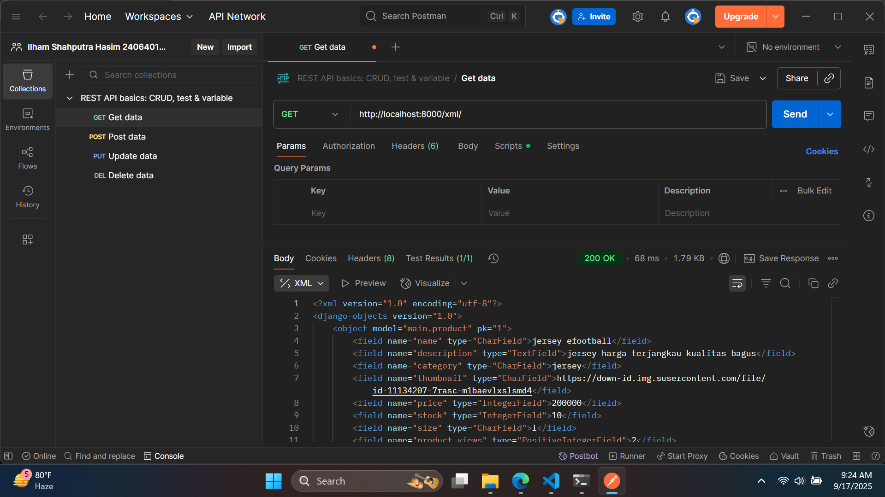
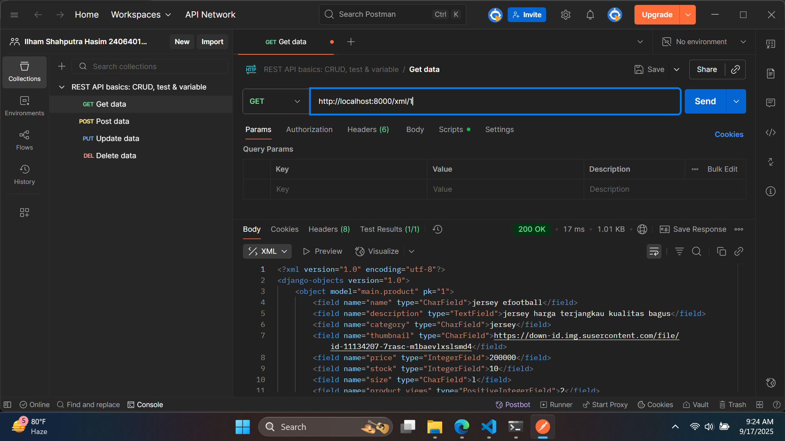
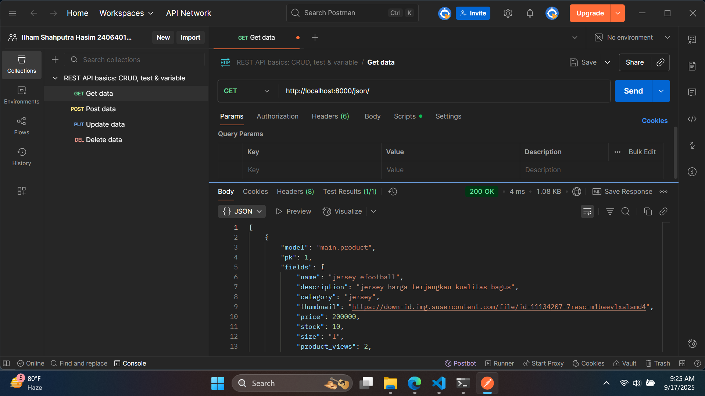
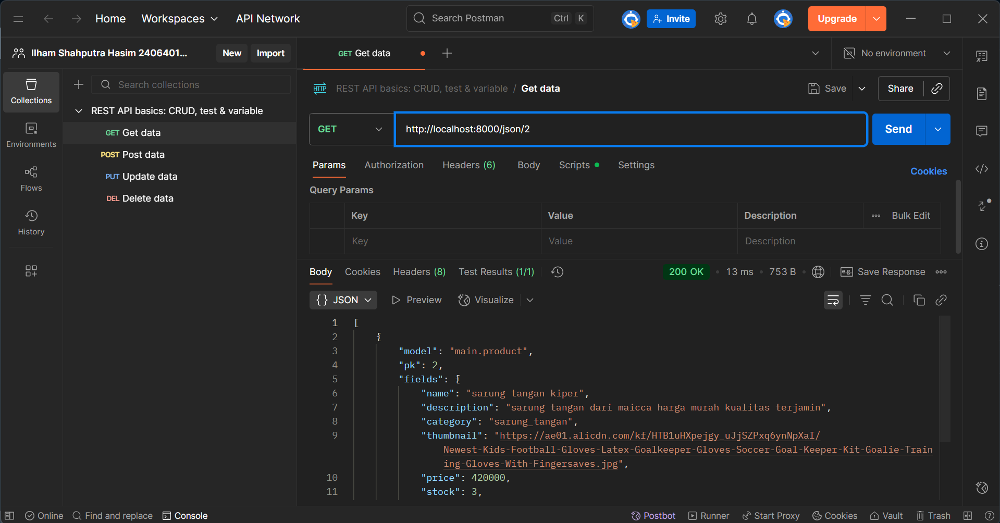

## Tugas 1
- [x]Membuat sebuah proyek Django baru.
    disini saya membuat proyek django baru dengan tema football shop jadi project yang dibuat saya beri nama goalies safehouse. sama memilih project ini karena saya merasa ini akan jadi menarik ketika football shop ini menjual peralatan khusus kiper.
    pada pembuatan project ini awalnya saya membuat repo baru dulu di github dengan nama 'Goalie-s-Safehouse' lalu saya melakukan cloning dari repo itu ke lokal dan saya mulai melakukan berbagai konfigurasi menggunakan folder hasil kloning itu. disitu saya memulai dengan mengunduh requirements yang dibutuhkan untuk project django setelah itu saya konfigurasi dari env, env.prod, settings database dan lain lain. setelah siap saya mencoba menjalankan server untuk memastikan bahwa project berhasil dibuat.

- [x]Membuat aplikasi dengan nama main pada proyek tersebut.
    disini saya membuat aplikasi dengan nama main dari project tersebut, lalu saya membuat folder templates yang berisikan file html yang nantinya akan digunakan untuk menampilkan informasi project saya, nama saya, npm saya, dan juga kelas saya. lalu saya mengisi bagian models sesuai dengan permintaan yang ada seperti di permintaan 4. setelah itu selesai saya melakukan routing dengan melakukan perubahan pada views.py, urls.py di main, dan urls.py di project utama.

- [x]Melakukan routing pada proyek agar dapat menjalankan aplikasi main.
    bagian ini saya lakukan setelah bagian pembuatan model selesai jadi saya membuat model terlebih dahulu baru melakukan routing sesuai dengan permintaan 5 dan 6

- [x]Membuat model pada aplikasi main dengan nama Product dan memiliki atribut wajib sebagai berikut.
    name sebagai nama item dengan tipe CharField.
    price sebagai harga item dengan tipe IntegerField.
    description sebagai deskripsi item dengan tipe TextField.
    thumbnail sebagai gambar item dengan tipe URLField.
    category sebagai kategori item dengan tipe CharField.
    is_featured sebagai status unggulan item dengan tipe BooleanField.

    saya membuat model pada models.py dengan atribut seperti yang diminta. setelah itu saya melakukan routing

- [x]Membuat sebuah fungsi pada views.py untuk dikembalikan ke dalam sebuah template HTML yang menampilkan nama aplikasi serta nama dan kelas kamu.
    mengisi views.py dengan fungsi yang akan mengembalkan nilai kedalam template html yang nantinya digunakan untuk menampilkan nama project, nama saya, npm saya, dan juga kelas saya

- [x]Membuat sebuah routing pada urls.py aplikasi main untuk memetakan fungsi yang telah dibuat pada views.py.
    melakukan routing agar views.py dapat dipanggil dan informasinya dapat melengkapi template html. disini saya melakukan perubahan pada urls.py di main terlebih dahulu baru dilanjutkan menambahkan informasinya ke urls.py di project utama.

- [x]Melakukan deployment ke PWS terhadap aplikasi yang sudah dibuat sehingga nantinya dapat diakses oleh teman-temanmu melalui Internet.
    sebagai langkah terakhir saya melakukan push git hub pekerjaan saya terdokumentasi dengan jelas dan saya melakukan push pws agar project ini dapat dilihat semua orang yang mengakses internet

- [x]Membuat sebuah README.md yang berisi tautan menuju aplikasi PWS yang sudah di-deploy, serta jawaban dari beberapa pertanyaan berikut.
    - Jelaskan bagaimana cara kamu mengimplementasikan checklist di atas secara step-by-step (bukan hanya sekadar mengikuti tutorial). saya sudah menjelaskan dibagian atas

    - Buatlah bagan yang berisi request client ke web aplikasi berbasis Django beserta responnya dan jelaskan pada bagan tersebut kaitan antara urls.py, views.py, models.py, dan berkas html.
    ```mermaid
    flowchart TD
        A[Client Browser] -->|HTTP Request| B[urls.py]
        B --> C[views.py]
        C -->|Ambil data| D[models.py]
        D --> C
        C --> E[Template HTML]
        E -->|HTTP Response| A
    ```
    
    jadi pertama ketika ketika pengguna mengakses URL tertentu maka Django akan mencocokkan URL request dengan pola (pattern) yang sudah didefinisikan di urls.py yang nantinya request diarahkan ke fungsi/kelas tertentu di views.py. Fungsi di views.py menerima request. Jika butuh data dari database, views.py memanggil models.py. models.py menyediakan interface antara views.py dan database jadi melalui models.py data data yang dibutuhkan akan diambil. setelah data diambil maka akan dimasukan ke HTML. HTML ini berisi struktur tampilan halaman web yang nantinya akan diakses pengguna. setelah semua data dimasukan ke HTML maka HTML ini akan dikembalikan ke client broser jadi pengguna dapat melihat tampilannya.

    
    - Jelaskan peran settings.py dalam proyek Django!
        settings.py ini layaknya sebuah pusat penganturan. semua konfigurasi dari framework django ada di file settings.py. mulai dari pengaturan database, pengaturan aplikasi yang diinstal, host yang diizinkan dan juga beberapa konfigurasi yang belum saya pelari seperti Middleware, Security, dan Authentication.
    
    - Bagaimana cara kerja migrasi database di Django?
        pentingnya migrasi dalam menggunakan framework django adalah ketika kita mengubah model (misalnya menambah field, menghapus field, atau membuat model baru), Django menyediakan cara otomatis untuk memperbarui skema database tanpa harus menulis SQL manual. prosesnya adalah ketika kita ada perubahan di models.py maka di terminal kita dapat menjalan kan perintah python manage.py makemigrations. dengan menjalankan perintah ini maka django akan membuat folder berkas migrasi yang berisi perubahan model yang belum diaplikasikan ke dalam basis data. setelah itu, dapat menjalankan perintah python manage.py migrate. dengan perintha migrate ini django akan mengaplikasikan perubahan model yang tercantum dalam berkas migrasi ke basis data.
    
    - Menurut Anda, dari semua framework yang ada, mengapa framework Django dijadikan permulaan pembelajaran pengembangan perangkat lunak?
        menurut saya karena dengan menggunakan django karena django sudah memiliki banyak fitur bawaan. selain itu django juga terbilang cepat dalam proses developmentnya jadi cocok untuk belajar dan yang paling penting django memiliki komunitas yang besar dan aktif. komunitas yang aktif ini menandakan bahwa django memang relevan dengan industri saat ini.
    
    - Apakah ada feedback untuk asisten dosen tutorial 1 yang telah kamu kerjakan sebelumnya? asdos sudah sangat membantu selama tutorial 1 dan 0, semangat trus kakak-kakak asdos


## TUGAS 2
- Jelaskan mengapa kita memerlukan data delivery dalam pengimplementasian sebuah platform?
agar Platform dapet mengirimkan data sceara real-time  dan server bisa mengirimkan data ke banyak client sekaligus sehingga client tidak perlu mengambil data secara manual

- Menurutmu, mana yang lebih baik antara XML dan JSON? Mengapa JSON lebih populer dibandingkan XML?
menurut saya lebih baik JSON karena JSON lebih mudah dibaca dan mirip dengan javascript.
alasan JSON lebih populer mungkin sama dengan pendapat saya JSON lebih mudah dibaca dan juga JSON support untuk javascript.

- Jelaskan fungsi dari method is_valid() pada form Django dan mengapa kita membutuhkan method tersebut?
Validasi data input berdasarkan aturan yang telah didefinisikan di form (misal max_length). lalu dapat Membersihkan data melalui method clean() atau clean_<field>(). sehingga dapat menghasilkan cleaned_data yang aman untuk digunakan.
hal ini dilakukan Untuk mencegah input yang tidak sesuai format masuk ke database sehingga dapat menjamin integritas data. selain itu dengan method ini dapat memudahkan penanganan error secara otomatis dengan menyediakan feedback ke user.

- Mengapa kita membutuhkan csrf_token saat membuat form di Django? Apa yang dapat terjadi jika kita tidak menambahkan csrf_token pada form Django? Bagaimana hal tersebut dapat dimanfaatkan oleh penyerang?
CSRF adalah serangan di mana penyerang memaksa user melakukan aksi yang tidak diinginkan di situs yang user sudah login. jadi fungsi csrf_token adalah membuat token unik yang hanya diketahui client dan server yang nantinya akan divalidasi ketika menerima request. jika tidak menambahkan csrf_token resikonya adalah serangan CSRF itu sendiri yang berbahaya dari serangan ini adalah attacker dapat menyisipkan perintah berbahaya yang tidak disadari oleh user(misal ubah password, hapus data). contoh eksploitasinya adalah attacker dapat membuat halaman eksternal dengan form yang submit ke situs target. Jika user login di situs target lalu membuka halaman attacker, form otomatis terkirim dan aksi tersebut dilakukan atas nama user secara tidak sadar.

- Jelaskan bagaimana cara kamu mengimplementasikan checklist di atas secara step-by-step (bukan hanya sekadar mengikuti tutorial).
saya membuat function baru di views untuk menampilkan XML dan JSON, lalu menambahkannya dengan menampilkannya dengan id. setelah itu di urls.py saya menambahkan import nama function dan menambhakannya di path. lalu saya coba menjalankannya via browser karena sudah bisa saya mencobanya lagi melalui postman dan menambahkannya di screenshoots dibawah. lalu saya mulai membuat bagian 2 yakni menambahkan halaman add product dan detail product. pada bagian ini saya sedikit merubah bagian models.py saya. saya menambahkan stock, size, dan juga created_at. hal ini saya laukan agar tampilan dari page add dan page dari detail lebih bagus. selain itu saya juga membuat categry untuk size dan kategori produk. hal ini saya lakukan agar ketika nanti di add page user bisa langsung memilih dari list yang ada. setelah merapihkan models.py saya membuat function di views yakni create product dan show product lalu menambahkan pathnya ke urls.py setelah itu selesai saya mulai menambahkan kode pada main.html lalu saya membuat create_product.html dan showproduct.html yang nantinya akan menjadi file html yang akan ditampilkan ketika user menuju ke add dan detail. setelah itu saya menambahkan csrf trusted origin lalu mencoba pengetesannya melalui local host dengan menambahkan product baru. karena sudah bisa semua saya melakukan push ke pws dan tugas 3 selesai

- Apakah ada feedback untuk asdos di tutorial 2 yang sudah kalian kerjakan? tidak ada, terima kasih kakak - kakak asdos







## TUGAS 3
- Mengimplementasikan fungsi registrasi, login, dan logout untuk memungkinkan pengguna mengakses aplikasi sebelumnya sesuai dengan status login/logoutnya.
disini saya menambahkan function baru di views.py lalu setelah itu mengkonfigurasikan routingnya di urls yaitu menambahkannyad di url patterns lalu menyiapkan file html yang nantinya akan ditampilkan ke user
- Membuat dua (2) akun pengguna dengan masing-masing tiga (3) dummy data menggunakan model yang telah dibuat sebelumnya untuk setiap akun di lokal.
mensimulasikannya dengan mencoba membuat akun pengguna dengan username ilham dan menambahkan 3 product akun tersebut. dapat dilihat digambar dibawah


- Menghubungkan model Product dengan User.
pada bagian product menambahkan user pembuatnya dan menampilkannya di show product dengan menambahkan identifier user di bagian create product di views.py
- Menampilkan detail informasi pengguna yang sedang logged in seperti username dan menerapkan cookies seperti last_login pada halaman utama aplikasi.
menambahkan cookie dibagian function login user pada views.py agar ketika user melakukan login datanya terekam dan tersimpan sebagai cookie di sisi client
- Menjawab beberapa pertanyaan berikut pada README.md pada root folder (silakan modifikasi README.md yang telah kamu buat sebelumnya; tambahkan subjudul untuk setiap tugas).
    - Apa itu Django AuthenticationForm? Jelaskan juga kelebihan dan kekurangannya.
    AuthenticationForm adalah form bawaan dari Django yang digunakan untuk membantu proses login pengguna. Form ini secara otomatis menyediakan field username dan password, serta melakukan validasi kredensial terhadap database user Django.  
    Kelebihan:
    - Sudah terintegrasi dengan sistem autentikasi Django.
    - Validasi login (username & password) dilakukan otomatis.
    - Aman karena password dicek dengan hashing, bukan plaintext.
    - Mudah digunakan dan bisa dikustomisasi.
    Kekurangan:
    - Kurang fleksibel jika ingin menambahkan field khusus (misalnya login dengan email).
    - Tampilan standar sangat sederhana, biasanya perlu kustomisasi form agar sesuai desain aplikasi.

    - Apa perbedaan antara autentikasi dan otorisasi? Bagaiamana Django mengimplementasikan kedua konsep tersebut?
    autentikasi digunakan untuk memverifikasi identitas user seperti apakah user ini adalah admin, penjual, atau pembeli. selain itu juga mengecek apakah nama dan password yang user masukan untuk sebuah akun itu valid. sedangkan autorisasi akan memberikan hak akses kepada user. misalnya sebagai admin user bisa merubah dan mengkustom tampilan website, sebagai pembeli user hanya bisa membeli barang dan memberi reviewnya sehingga user pembeli tidak dapat menjual barang.
    - Apa saja kelebihan dan kekurangan session dan cookies dalam konteks menyimpan state di aplikasi web?
    Session:
    Kelebihan:
    - Data tidak langsung tersimpan di browser user, melainkan di server.
    - Bisa menyimpan data lebih kompleks.
    Kekurangan:
    - Membutuhkan manajemen di server.
    - Jika server down, session bisa hilang jika tidak dikelola dengan baik.

    Cookies:
    Kelebihan:
    - Ringan, disimpan langsung di browser user.
    - Tidak membutuhkan penyimpanan tambahan di server.
    Kekurangan:
    - Kapasitas kecil.
    - Lebih rentan terhadap pencurian/penyalahgunaan (misalnya cookie hijacking).

    - Apakah penggunaan cookies aman secara default dalam pengembangan web, atau apakah ada risiko potensial yang harus diwaspadai? Bagaimana Django menangani hal tersebut?
    Cookies tidak sepenuhnya aman secara default, karena cookie bisa diakses/dicuri lewat serangan seperti XSS (Cross-Site Scripting) atau cookie hijacking.  

    Risiko potensial:
    - Cookie bisa dicuri jika tidak diamankan dengan HttpOnly.
    - Bisa dipalsukan jika tidak menggunakan enkkripsi.
    - Rentan di jaringan tidak aman tanpa Secure flag (HTTPS).

    cara penanganannya di Django:
    - Menggunakan HttpOnly cookie agar tidak bisa diakses dengan JavaScript.
    - Mendukung Secure flag untuk memastikan cookie hanya dikirim lewat HTTPS.
    - Session cookies Django ditandatangani secara kriptografis untuk mencegah pemalsuan.
    - Developer bisa mengatur opsi tambahan di `settings.py` seperti:
    - SESSION_COOKIE_SECURE = True
    - SESSION_COOKIE_HTTPONLY = True
    - CSRF_COOKIE_SECURE = True